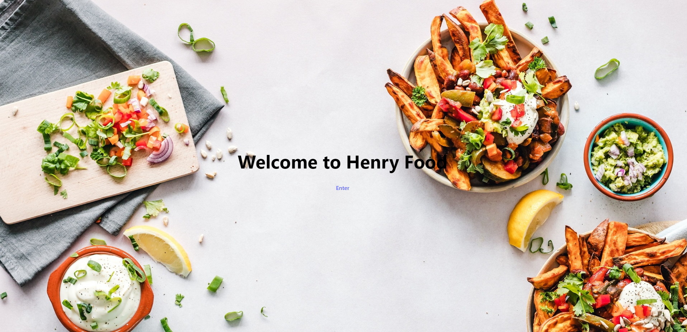
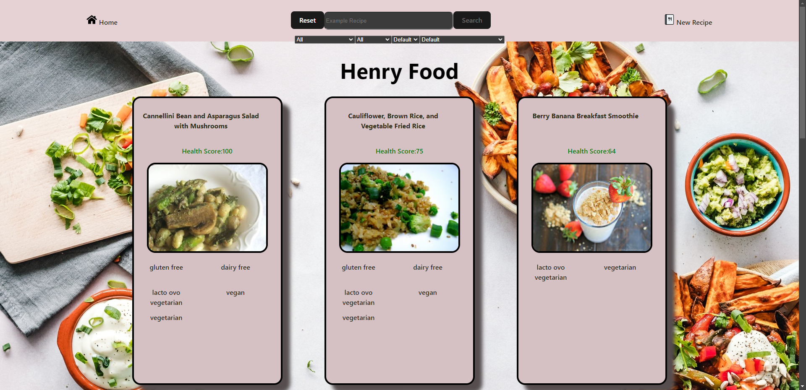
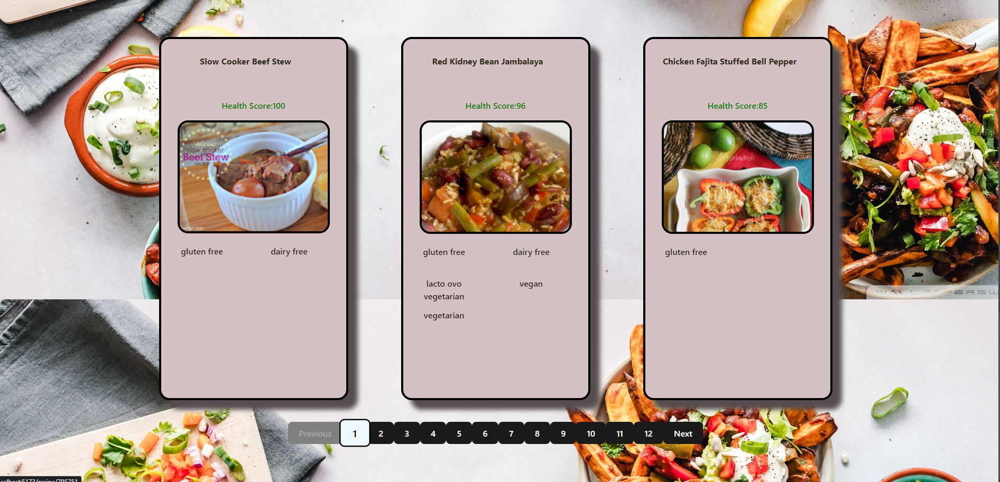
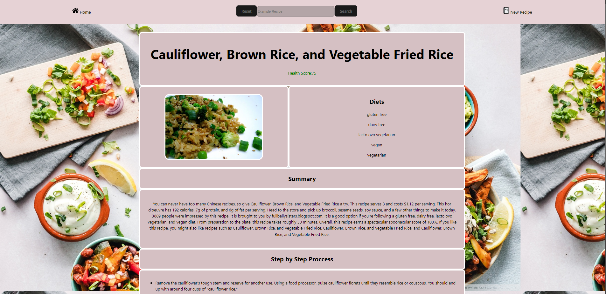
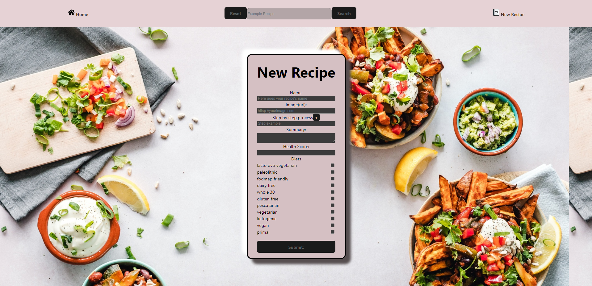

# **FOOD** | Proyecto Individual

- Single Page Application utlizando las tecnologías: **React**, **Redux**, **Node**, **Express** y **Sequelize**.
 

---
# **Landing Page**

 

---
# **Home Page**
  En la home page, se pueden ver todas las recetas disponibles, tiene distintos filtros y ordenamientos, además tiene una barra de busqueda, al hacer click en alguna receta se hace un redireccionamiento
   al detalle de cada receta, donde hay más información de esta.

 

---
Tambien la home page cuenta con un páginado.

 

---
# **Detail Recipe**
En el detail de cada receta, se puede encontrar información más detallada de esta como por ejemplo unas instrucciones paso a paso de como cocinarla o un resumen de en que consiste la receta

 

---
# **Form Recipe Creation**
Finalmente en el formulario de creación, se puede registrar una nueva receta. 

